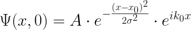
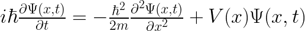
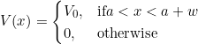
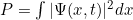
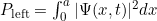
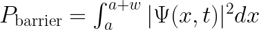
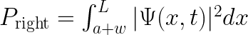
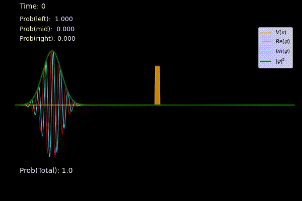

# Quantum Tunneling Simulation with Finite Potential Well

## Introduction

This project simulates **quantum tunneling** through a finite potential barrier using Python. Quantum tunneling is a fundamental phenomenon in quantum mechanics where a particle has a probability to pass through a potential barrier, even if its energy is less than the height of the barrier. This project visualizes the evolution of a **Gaussian wave packet** interacting with a potential barrier over time.

The simulation numerically solves the time-dependent Schrödinger equation using eigenfunction expansion methods and visualizes the tunneling process.

---

## Installation

1. **Clone the Repository:**

   ```bash
   git clone https://github.com/Batuhan/Quantum-Tunneling-Simulation.git
   cd Quantum-Tunneling-Simulation
   ```

2. **Install Required Dependencies:**

   Make sure you have Python 3 installed. Then, install the necessary libraries:

   ```bash
   pip install numpy matplotlib numba
   ```

---

## Running the Simulation

To run the simulation and visualize the quantum tunneling process, execute the following command:

```bash
python quantum_tunneling.py
```

The script will generate wavefunction evolution plots that show the tunneling behavior over time.

---

## Code Overview

### 1. Gaussian Wave Packet

The initial wave function is defined as a **Gaussian wave packet**, given by the equation:



Where:
- **$A$** is the normalization constant,  
- **$x_0$** is the initial position of the wave packet,  
- **$\sigma$** is the width (spread) of the packet,  
- **$k_0$** is the initial momentum (wave number).

This wave packet represents a localized particle with a certain momentum directed towards the potential barrier.

---

### 2. Time-Dependent Schrödinger Equation

The evolution of the wave packet is governed by the **time-dependent Schrödinger equation**:



Where:
- **$\hbar$** is the reduced Planck's constant (set to 1 in this simulation),  
- **$m$** is the mass of the particle (set to 1 for simplicity),  
- **$V(x)$** is the potential energy function representing the barrier.

The numerical solution involves diagonalizing the Hamiltonian and using eigenfunction expansion to compute the time evolution of the wave packet.

---

### 3. Potential Barrier

The finite potential barrier is defined as:



Where:
- **$V_0$** is the height of the potential barrier,  
- **$a$** is the starting position of the barrier,  
- **$w$** is the width of the barrier. 

If the particle's energy is less than **$V_0$**, classical mechanics predicts total reflection. However, in quantum mechanics, there's a non-zero probability that the particle will tunnel through the barrier.

---

### 4. Tunneling Probability

The probability of finding the particle in different regions is computed by integrating the squared modulus of the wave function:



- **Left of the barrier (reflection probability):**

 

- **Inside the barrier:**

 

- **Right of the barrier (transmission probability):**

  

These probabilities evolve over time, illustrating the quantum tunneling effect.

---

## Simulation Parameters

You can modify the following parameters in the `wavepacket()` function to explore different scenarios:

- **`N_grid`**: Number of grid points (spatial resolution).
- **`L`**: Length of the spatial domain.
- **`a`**: Starting position of the potential barrier.
- **`V0`**: Height of the potential barrier.
- **`w`**: Width of the potential barrier.
- **`x0`**: Initial position of the wave packet.
- **`k0`**: Initial momentum of the wave packet.
- **`sigma`**: Width of the Gaussian wave packet.
- **`t`**: Total simulation time.

---

## Sample Output

The following plot demonstrates how the Gaussian wave packet evolves over time and interacts with the potential barrier:



---

## License

This project is licensed under the **MIT License**.

---

Feel free to contribute or open issues if you encounter any problems!

